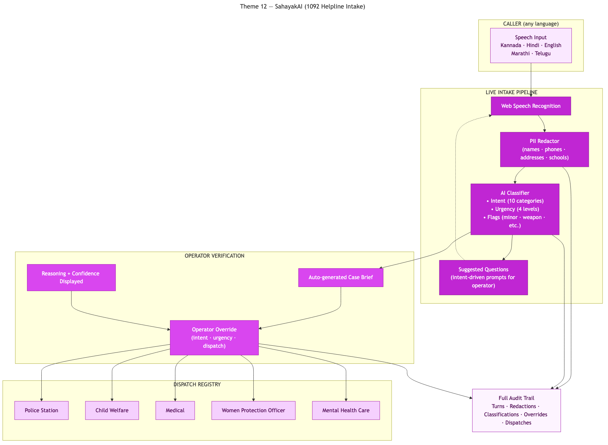

# SahayakAI — 1092 Helpline Intake

AI-assisted intake for the 1092 helpline: transcribe, classify urgency, redact PII, and route to the right department with full explainability.

> **PanIIT AI for Bharat Hackathon** — Theme 12: AI for 1092 Helpline

SahayakAI is an operator console for India's 1092 women and child distress helpline. It captures multilingual speech in the browser, stores raw and redacted transcripts, runs mock-first intent and urgency classification with explainable reasoning, proposes synthetic dispatch targets, and requires an operator verification step before any dispatch is created.

## Quick Start

```bash
git clone https://github.com/sridhar7601/helpline-1092-ai.git
cd helpline-1092-ai
cp .env.example .env
npm install
npx prisma generate
npx prisma db push
npm run seed
npm run dev
```

Open [http://localhost:3000](http://localhost:3000). Use `Start new call` for live intake in a Chromium-based browser.

## Demo Data

`npm run seed` clears existing cases and inserts 30 deterministic synthetic cases with mixed intents, urgency levels, verifier notes, and dispatch-ready examples.

## Architecture

Browser speech intake feeds transcript storage, PII redaction, explainable case classification, synthetic dispatch proposal, and operator verification before dispatch.



## Tech Stack

- Next.js App Router + TypeScript
- Prisma + SQLite
- Tailwind CSS + shadcn-style UI primitives + Tremor charts
- Web Speech API in `lib/speech.ts`
- Mock-first AI classification in `lib/ai.ts`
- Synthetic dispatch registry in `lib/dispatch-registry.ts`

## Demo Flow

1. Open the dashboard and click `Start new call`.
2. Speak a sample complaint and show the live multilingual transcript capture.
3. Review the redacted transcript, predicted intent, urgency, confidence, reasoning, and follow-up prompts.
4. Finalize the case and show the operator verification step with notes.
5. Dispatch the verified case to a suggested synthetic department and review the resulting audit trail.

## Key Features

- Multilingual browser-based speech intake for helpline operators.
- PII redaction on transcripts before downstream review.
- Explainable mock-first classification for intent, urgency, confidence, and risk flags.
- Synthetic dispatch registry that can be extended as routing targets evolve.
- Mandatory human verification before dispatch so the system never routes silently.

## Documentation

[docs/solution-document.md](docs/solution-document.md) · [PDF](docs/solution-document.pdf)

## Verification

```bash
npm install
npx tsc --noEmit
npm run build
npm run seed
npm run dev
```

## License

Hackathon submission
